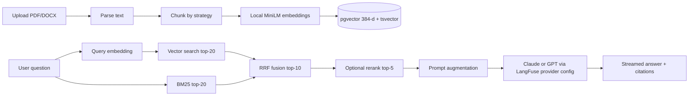

# Architecture

## Overview

This POC implements a **Hybrid Search RAG** pipeline with optional reranking, LangFuse observability, and a Streamlit demo UI. It is designed for education, not production scale.

## Service topology

```
Streamlit (:8501) ──► FastAPI (:8000) ──► postgres-rag + pgvector (host :5430)
                              │
                              ├──► Local embeddings (sentence-transformers)
                              ├──► Anthropic API (Claude Sonnet, default)
                              ├──► OpenAI API (optional, LangFuse provider=openai)
                              └──► LangFuse (:3000)
                                        ├── langfuse-postgres
                                        ├── ClickHouse
                                        ├── Redis
                                        └── MinIO

pgAdmin (:5050) ──► postgres-rag
```

## RAG pipeline



## Data model

### documents

Stores uploaded file metadata and local path under `uploads/`.

### chunks

Each chunk row contains:

- `content` — text segment
- `embedding` — `vector(384)` from local sentence-transformers
- `search_vector` — PostgreSQL `tsvector` for BM25-style keyword search
- `strategy` — chunking method used at ingest
- `parent_chunk_id` — optional hierarchy hint (semantic strategy)

## Retrieval modes

| Mode | Behavior |
|------|----------|
| **naive** | pgvector cosine similarity only (top 10) |
| **hybrid** | Dense + BM25 fused with RRF (k=60), top 10 |
| **+ rerank** | Cross-encoder rescores candidates to top 5 |

## Observability

LangFuse traces cover:

- Document ingestion (filename, strategy, chunk count)
- Chat query (`rag-query` trace with question input; both `/api/v1/chat` and `/api/v1/chat/stream`)
- Retrieval span (chunk IDs, scores, source type)
- Generation span (answer, provider, model, token usage when available)

If LangFuse is unavailable, prompts and model settings fall back to [`config/langfuse/prompts.yaml`](../config/langfuse/prompts.yaml) via `prompt_registry.py`.

Managed prompts can be synced to LangFuse with `./scripts/sync_langfuse.sh`.

## Secrets and configuration

All secrets are loaded from environment variables via `.env` (never committed). Docker Compose injects service URLs internally; external access uses mapped ports on localhost.

## Local file storage

Uploaded files are written to `./uploads/` (bind-mounted volume). This keeps the POC simple and makes pgAdmin + file inspection easy during demos.
